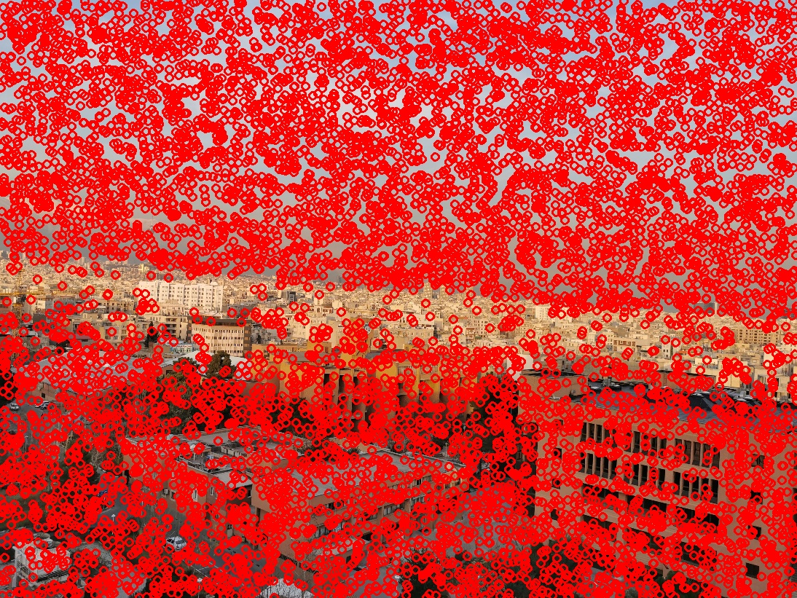
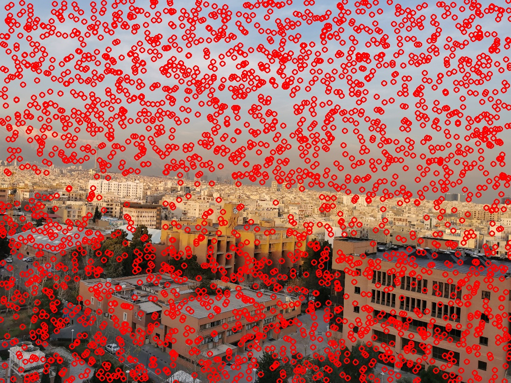

# Harris Corner Detector
My advanced 3D Computer Vision homework at Sharif University of Technology (SUT).

Harris is implemented using the following steps
1. X and Y derivatives of the image is calculated using sobel in OpenCV (This is done by specifying the windows size which moves on image pixels and calculates derivatives in it)
2. Covariance of the Matrix is calculated by defining $I_{x}^{2}$, $I_{y}^{2}$ and $I_{x}I_{y}$
3. Now we convolve the structure tensor with a Gaussian filter to smooth the results
4. Now we should calculate the following equation which gives us the Harris responce we need: $ Det(H) / Trace(H) = det(A) - kTrace^2(A)$ 
5. At last we should find the corners in the results above a specific threshold
6. As it is noticeable above, there are several hyper parameters that needs to be defined for best results which are k, window size and threshold. To find the best combination of these I wrote an experiment of different variables of each and exported the image of the results with the corresponding values of it. Some of the outputs are visible below:
    - For K=0.04, windowSize=3 and threshold=0.99
     
    
    - For K=0.04, windowSize=3 and threshold=0.99999999
     
    
     
By running the code a total of 440 images with different hyper parameters will be generated.
You can review the details of code in `code_explain.ipynb`
